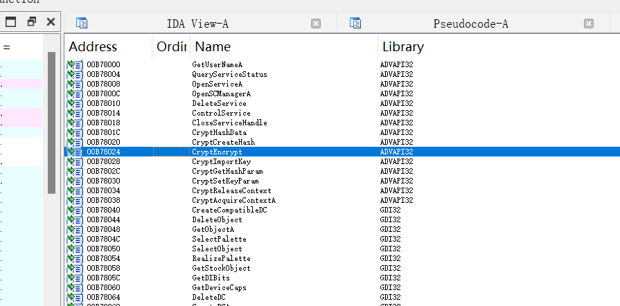

# Lab3 - malware2

## 环境配置

Windows 11 安装 WireShark 及 IDA Pro。

## 分析过程

在 IDA 中打开 `Server_L2.exe` 文件，在Imports标签页中寻找其使用的库函数，在其中发现了与 `Crypto` 相关的函数，如下图所示。



在主程序中寻找调用其调用其函数的地方，发现函数 `sub_402620` 中对其进行了调用，`sub_402620` 函数中的代码如下：

```c
char *__cdecl sub_402620(int a1, BYTE *a2)
{
  BYTE pbData[2]; // [esp+0h] [ebp-7Ch] BYREF
  __int16 v4; // [esp+2h] [ebp-7Ah]
  int v5; // [esp+4h] [ebp-78h]
  size_t Size; // [esp+8h] [ebp-74h]
  char v7[32]; // [esp+Ch] [ebp-70h] BYREF
  BYTE v8[4]; // [esp+2Ch] [ebp-50h] BYREF
  int v9; // [esp+30h] [ebp-4Ch]
  int v10; // [esp+34h] [ebp-48h]
  int v11; // [esp+38h] [ebp-44h]
  int v12; // [esp+3Ch] [ebp-40h]
  int v13; // [esp+40h] [ebp-3Ch]
  int v14; // [esp+44h] [ebp-38h]
  int v15; // [esp+48h] [ebp-34h]
  int v16; // [esp+4Ch] [ebp-30h]
  void *Src; // [esp+50h] [ebp-2Ch]
  char *v18; // [esp+54h] [ebp-28h]
  HCRYPTKEY phKey; // [esp+58h] [ebp-24h] BYREF
  BOOL Final; // [esp+5Ch] [ebp-20h]
  size_t v21; // [esp+60h] [ebp-1Ch]
  BOOL v22; // [esp+64h] [ebp-18h]
  int v23; // [esp+68h] [ebp-14h]
  DWORD pdwDataLen; // [esp+6Ch] [ebp-10h] BYREF
  size_t v25; // [esp+70h] [ebp-Ch]
  HCRYPTPROV phProv; // [esp+74h] [ebp-8h] BYREF
  size_t i; // [esp+78h] [ebp-4h]

  *(_DWORD *)v8 = 0;
  v9 = 0;
  v10 = 0;
  v11 = 0;
  v12 = 0;
  v13 = 0;
  v14 = 0;
  v15 = 0;
  v23 = 0;
  v16 = *(_DWORD *)a1;
  v25 = *(_DWORD *)(a1 + 4);
  v18 = (char *)malloc(v25);
  pbData[0] = 8;
  pbData[1] = 2;
  v4 = 0;
  v5 = 26126;
  Size = dword_420000;
  memset(v7, 0, sizeof(v7));
  if ( !CryptAcquireContextA(&phProv, 0, "Microsoft Enhanced RSA and AES Cryptographic Provider", 0x18u, 0)
    && !CryptAcquireContextA(&phProv, 0, "Microsoft Enhanced RSA and AES Cryptographic Provider", 0x18u, 8u) )
  {
    _loaddll(0);
  }
  Src = (void *)sub_402820(phProv, a2);
  memmove(v7, Src, Size);
  if ( !CryptImportKey(phProv, pbData, 0x2Cu, 0, 0, &phKey) )
  {
    CryptReleaseContext(phProv, 0);
    _loaddll(0);
  }
  if ( !CryptSetKeyParam(phKey, 1u, &::pbData, 0) )
    _loaddll(0);
  for ( i = 0; i < v25; i += dword_420004 )
  {
    v22 = v25 - i < dword_420004;
    Final = v22;
    if ( v25 - i >= dword_420004 )
      v21 = dword_420004;
    else
      v21 = v25 - i;
    pdwDataLen = v21;
    memmove(v8, (const void *)(i + v16), v21);
    CryptEncrypt(phKey, 0, Final, 0, v8, &pdwDataLen, 0x20u);
    memmove(&v18[v23], v8, pdwDataLen);
    v23 += pdwDataLen;
  }
  return v18;
}
```

退回分析其调用栈，其入口函数为 `WinMain`, 随后有如下调用

- `WinMain`
- `sub_403610`
- `sub_402D40`
- `sub_4030C0`
- `sub_4014C0`
- `sub_402620`

分析函数 `sub_402620` 的代码，查看其中 `Src = (void *)sub_B62820(phProv, a2);` 中对 `sub_B62820` 函数的调用，其函数代码如下：

```c
BYTE *__cdecl sub_402820(HCRYPTPROV hProv, BYTE *pbData)
{
  DWORD v2; // eax
  BYTE v4[64]; // [esp+0h] [ebp-48h] BYREF
  DWORD pdwDataLen; // [esp+40h] [ebp-8h] BYREF
  HCRYPTHASH phHash; // [esp+44h] [ebp-4h] BYREF

  memset(v4, 0, sizeof(v4));
  pdwDataLen = 32;
  if ( !CryptCreateHash(hProv, 0x800Cu, 0, 0, &phHash) )
    _loaddll(0);
  v2 = strlen((const char *)pbData);
  if ( !CryptHashData(phHash, pbData, v2, 0) )
    _loaddll(0);
  if ( !CryptGetHashParam(phHash, 2u, v4, &pdwDataLen, 0) )
    _loaddll(0);
  return v4;
}
```

查询其中 `CryptCreateHash`, `CryptHashData`, `CryptGetHashParam` 函数的文档，

- [CryptCreateHash](https://learn.microsoft.com/en-us/windows/win32/api/wincrypt/nf-wincrypt-cryptcreatehash)
- [CryptHashData](https://learn.microsoft.com/en-us/windows/win32/api/wincrypt/nf-wincrypt-crypthashdata)
- [CryptGetHashParam](https://learn.microsoft.com/en-us/windows/win32/api/wincrypt/nf-wincrypt-cryptgethashparam)

函数 `sub_B62820` 的功能是对输入的字符串进行哈希计算，其计算结果为 `v4`，根据提供给以上三个库函数的参数同时可以得知其使用的哈希算法为 `SHA-256`. 同时，哈希的明文为 `a2`，即函数 `sub_402620` 的第二个参数。

对调用 `sub_402620` 之前的过程进行分析，可以发现直接调用它的 `sub_4014C0` 函数在 `a2` 处传递了一个内存地址 `byte_420960`，查看后发现此处为一个 16 个 Bytes 的数组，再查看前后几个函数，这个数组内保存的均为常量，为：`Am!1Bob2DCc4@#q3`. 

函数 `sub_4014C0` 的代码如下，

```c
char __stdcall sub_4014C0(
        SOCKET s,
        int a2,
        char FileName,
        int a4,
        int a5,
        int a6,
        int a7,
        int a8,
        int a9,
        int a10,
        int a11,
        int a12,
        int a13,
        int a14,
        int a15,
        int a16,
        int a17,
        int a18,
        int a19,
        int a20,
        int a21,
        int a22,
        int a23,
        int a24,
        int a25,
        int a26,
        int a27,
        int a28,
        int a29,
        int a30,
        int a31,
        int a32,
        int a33,
        int a34,
        int a35,
        int a36,
        int a37,
        int a38,
        int a39,
        int a40,
        int a41,
        int a42,
        int a43,
        int a44,
        int a45,
        int a46,
        int a47)
{
  char Buffer[4096]; // [esp+0h] [ebp-1020h] BYREF
  int v49[4]; // [esp+1000h] [ebp-20h] BYREF
  char *buf; // [esp+1010h] [ebp-10h]
  int len; // [esp+1014h] [ebp-Ch]
  int v52; // [esp+1018h] [ebp-8h]
  FILE *Stream; // [esp+101Ch] [ebp-4h]

  Stream = fopen(&FileName, "rb");
  if ( !Stream )
    return 0;
  v52 = 0;
  if ( fseek(Stream, 0, 2) || (v52 = ftell(Stream), v52 == -1) || fseek(Stream, 0, 0) )
  {
    fclose(Stream);
    return 0;
  }
  else
  {
    a35 = v52;
    while ( 1 )
    {
      len = fread(Buffer, 1u, 0x1000u, Stream);
      if ( !len )
        break;
      v49[0] = (int)Buffer;
      v49[1] = len;
      buf = (char *)sub_402620((int)v49, &byte_420960);
      if ( !sub_401A10(s, buf, len, 0, 0) )
      {
        fclose(Stream);
        return 0;
      }
    }
    fclose(Stream);
    return 1;
  }
}
```

回到完成哈希的函数 `sub_402820`，其对字符串 `Am!1Bob2DCc4@#q3` 进行了 SHA-256 计算。计算结果为：

```
2e5ab4aa66bf9b0ac2f59a62d932301a4c5de438520027972e76290b784c719a
```

再次查看加密函数 `sub_402620` 的代码，其对哈希结果进行了截断，并将前 32 个 Bytes 作为密钥输入到 `CryptImportKey` 函数中，需要注意的是此处 IDA 的逆向代码稍有 tricky，其认为输入的起始地址为 `pbData`，但 `0x2Cu` 的长度实际包含了我们哈希结果的前 32 个 Bytes.

查看如下五个函数的文档 `CryptAcquireContextA`, `CryptImportKey`, `CryptReleaseContext`, `CryptSetKeyParam` 和 `CryptEncrypt`,

- [CryptAcquireContextA](https://learn.microsoft.com/en-us/windows/win32/api/wincrypt/nf-wincrypt-cryptacquirecontexta)
- [CryptImportKey](https://learn.microsoft.com/en-us/windows/win32/api/wincrypt/nf-wincrypt-cryptimportkey)
- [CryptReleaseContext](https://learn.microsoft.com/en-us/windows/win32/api/wincrypt/nf-wincrypt-cryptreleasecontext)
- [CryptSetKeyParam](https://learn.microsoft.com/en-us/windows/win32/api/wincrypt/nf-wincrypt-cryptsetkeyparam)
- [CryptEncrypt](https://learn.microsoft.com/en-us/windows/win32/api/wincrypt/nf-wincrypt-cryptencrypt)

分析其传递参数的过程，得知使用的加密算法为 `AES-128-CBC`，传递给偏移量 `iv` 的参数为一个固定的数组 `pbData`，其值如下图所示，


现在得知了加密算法和所有解密所需的信息，然后从 PCAP 文件中寻找密文。同样使用 Wireshark 进行过滤，过滤条件为 `tcp and ip.dst == 192.168.1.2` 并进行流追踪，得到如下结果，


取其最后 32 个 Bytes 作为密文（与 malware 1 相同的字节位置）。

至此，已经得到了解出 flag 的全部信息，使用 Python 编写程序`get_flag.py`，使用对应算法 `AES-128-CBC` ，配合所发现的密钥和 `iv` 解密后得到 flag 为：

```
flag{1Easy_mA1War3_ANalys1s_KMI}
```