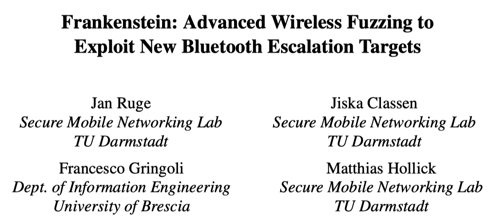
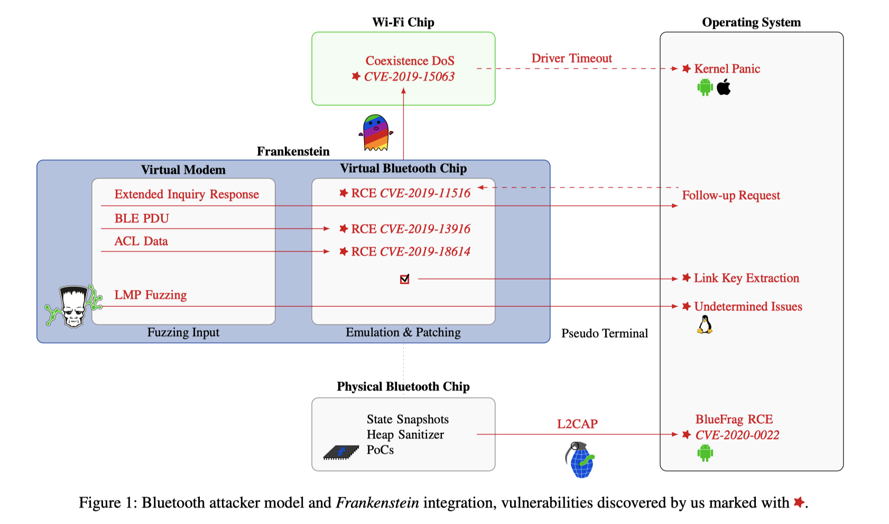
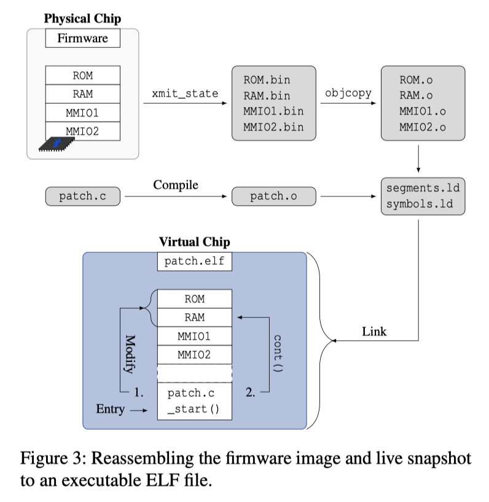
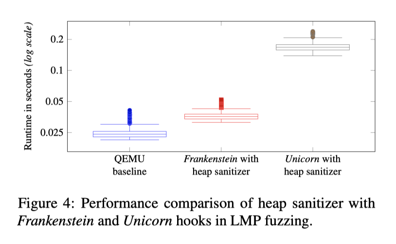

# 阅读推荐 2022-12-10 Frankenstein

今天为大家推荐的是一篇来自德国达姆施塔特工业大学关于蓝牙模块的模糊测试论文 Frankenstein: Advanced Wireless Fuzzing to Exploit New Bluetooth Escalation Targets. 该工作收录于29th USENIX Security Symposium.

这篇论文主要讨论了无线通信标准和实现的安全性问题。由于大多数实现和固件是闭源的，模糊测试仍然是发现部署系统中的远程代码执行（RCE）漏洞的主要方法之一。通用的over-the-air模糊测试存在一些缺点，例如受限的速度、可重复性有限以及调试能力受限。因此，论文提出了一种基于高级固件模拟的模糊测试框架Frankenstein，它可以解决这些缺点。

作者用Frankenstein框架在Broadcom和Cypress蓝牙堆栈中发现了三个零点击漏洞，这种堆栈被广泛用于苹果设备、三星智能手机、Raspberry Pi等。如果攻击者成功利用蓝牙芯片上的RCE漏洞，可能会提高攻击者的特权并超出芯片的边界。作者还发现了一个Wi-Fi/蓝牙共存问题，可以使得多种操作系统内核崩溃，以及一个在蓝牙5.2规范中的设计缺陷，可以从主机中提取链接密钥。作者发现关闭蓝牙功能并不能完全禁用芯片，这使得防御RCE攻击变得困难。此外，在测试芯片漏洞时，作者发现了BlueFrag，一种与芯片无关的Android RCE。

## 攻击场景

作者在介绍Frankenstein之前讨论了RCE漏洞对蓝牙的攻击效果，作者在论文的第三章中提出了几种场景，分别是：

- 攻击者可以在不破坏蓝牙兼容性的前提下执行一种符合规范的提取链接密钥的攻击，这可能会导致受害者的隐私数据被窃取；
- 攻击者还发现由于现在的蓝牙和Wi-Fi通常由同一个芯片承载，因此可以通过蓝牙攻击入侵芯片，并以此作为跳板攻击Wi-Fi功能（例如无法开启或性能降低等）乃至系统kernel panic重启；
- 攻击者还提出了一种绕过蓝牙芯片安全保护，执行非法写入的方法，这样有比较大的可能性导致蓝牙芯片“变砖”，甚至可以被认为是一种永久的损坏；
- 最后作者讨论了防御RCE攻击的困难，因为在现代的智能操作系统（如iOS或Android）上，关闭蓝牙功能或打开飞行模式并不能保证重置芯片的内存。

## Frankenstein系统设计

Frankenstein通过在Quick Emulator（QEMU）中仿真物理设备snapshot来模糊测试整个栈：over-the-air由虚拟调制解调器提供，仿真固件实现了线程和任务切换，以模糊测试多个处理程序，并将其连接到真实的Linux主机。Frankenstein的系统设计如下图所示（原文Figure 1）。

在初始化阶段，Frankenstein提供了一些hook函数，用于提供对芯片内存的处理能力，比如：

- map_memory能够记录所有的内存映射，以便在后续的模糊测试中使用；
- xmit_state会关闭watch_dog，通过HCI复制保存内存数据。

Frankenstein运行在用户模式下，并使用未修改的QEMU进行仿真。前面提到保存下来的快照是没有符号的原始二进制文件。作者将其重新组装为可执行和链接格式（ELF）文件，如下图（原文Figure 3）所示。用户定义的代码编译并链接到固件映像中，而编译后的代码存储在单独的页面中，并提供模拟的初始入口_start，它共享与固件相同的地址空间，因此可以调用函数并解析映像中的数据结构。语法与固件中的任何C代码相同。它还添加新功能并进行修改，以替换缺失的物理硬件。

同时作者为了保证在不支持中断的Linux用户模式下运行，禁用了启用和禁用中断的函数。基于时间的函数（例如delay）使用特殊用途硬件也被替换。作者通过这种方式完成了硬件到软件的兼容性。在进行了这些修改后，固件运行直到空闲线程从中断返回。作者将栈上的那个返回地址替换为指向预设函数的指针。在此函数中，我们可以像正常函数调用一样调用中断处理程序，以保留线程行为，得以注入HCI流量或蓝牙帧。

Frankenstein通过一种轻量级的hooks机制修改仿真固件和物理设备的固件，这使得为Frankenstein编写的代码最终都能够在物理设备上运行。这里用到了Broadcom的Patchram技术，使得Frankenstein可以跟踪函数调用并分析在QEMU和物理设备上运行的中断处理程序及其相应的状态寄存器。它还支持编写针对物理硬件上运行的over-the-air固件漏洞的PoC。

作者在实验平台（一台笔记本电脑上）将其实现的Frankenstein与另一个先进的固件hooks工具Unicorn进行了对比，如下图所示（原文Figure 4），Frankenstein在预设的实验条件下达到了比Unicorn提高585.5%的运行性能评价。

将Frankenstein连接到真实的操作系统上后可以实现全栈的模糊测试。在物理设备上通过UART将HCI数据发送给主机，打开Pseudo Terminal Master（PTM）会创建一个文件描述符，模拟器通过Linux的read和write系统调用使用它。然后，操作系统会创建相应的Pseudo Terminal Slave（PTS），它类似于虚拟串行接口。然后将PTS传递给btattach以将模拟器附加到Linux BlueZ蓝牙堆栈。

## 模糊测试结果和攻击

作者随后介绍了三种针对堆的溢出攻击：

- （CVE-2019-11516）当设备扫描其他设备时，这些设备可以用EIR响应。 EIR包含其他信息，例如设备名称，它被复制到HCI事件中，供用户显示以列出可用于配对的设备。 受到一定物理层的约束，固件在复制EIR信息时跳过了长度检查，这导致了堆溢出漏洞；
- （CVE-2019-13916）描述了在接收蓝牙低能耗（LE）协议数据单元（PDU）时的堆溢出；
- （CVE-2019-18614）则描述了经典蓝牙在ACL模式下的缓冲区溢出漏洞。

## 结论

总而言之，作者设计了Frankenstein，这是一种基于高级固件模拟的模糊测试框架，用于发现无线通信系统中的远程代码执行漏洞。它通过模拟芯片的虚拟调制解调器来为芯片提供模糊测试输入。通过该方法，作者发现了Broadcom和Cypress蓝牙堆栈中的三个零点击漏洞，并发现了一个芯片独立的Android RCE，即BlueFrag。

论文下载：https://www.usenix.org/system/files/sec20-ruge.pdf