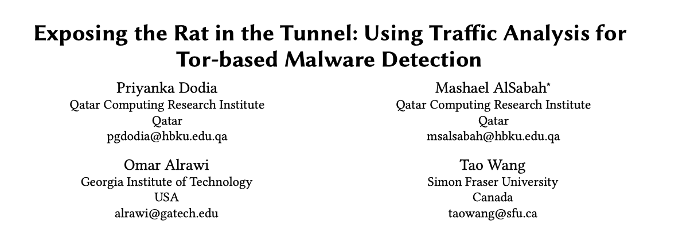
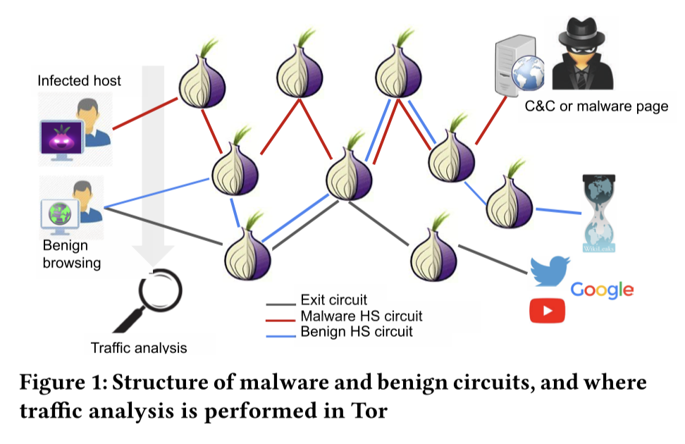
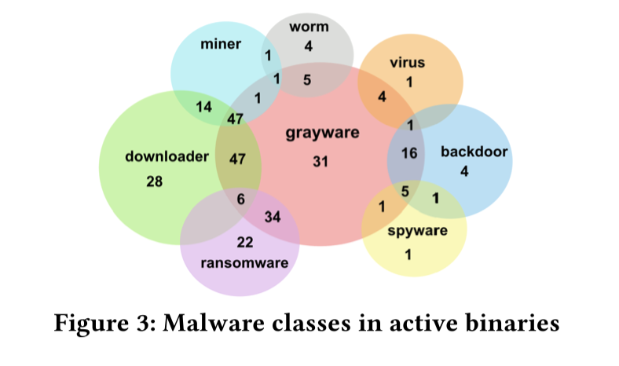
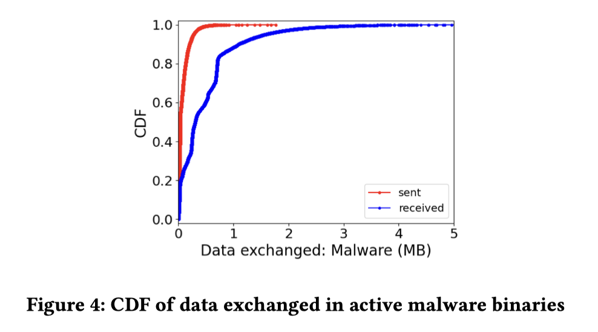
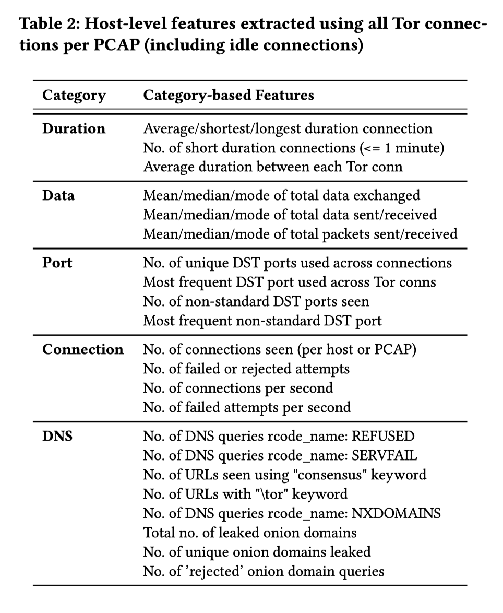
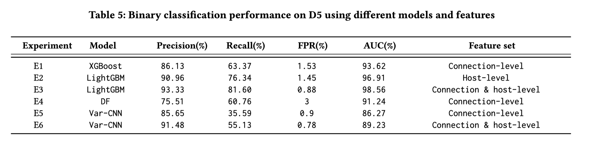
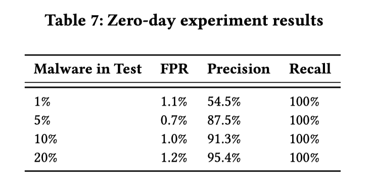

# 阅读推荐 2023-01-07 Tor-based Malware Detection with Traffic Analysis

今天为大家推荐的是一篇来自卡塔尔计算研究所的关于使用流量分析检测基于Tor的恶意软件的论文 *Exposing the Rat in the Tunnel: Using Traffic Analysis for Tor-based Malware Detection*. 该工作收录于 CCS '22.

这篇论文主要讲述了一种能够准确识别Tor网络上恶意软件通信的方法。Tor是一种广泛使用的匿名通信网络，被许多恶意软件用来隐藏它们的存在。作者认为Tor是促进互联网自由和隐私的重要工具，因此阻止它以防止这类恶意软件出现是不应当的。

因此，在这项工作中，作者提出了一种有效的流量分析方法，可以准确地识别基于Tor的恶意软件通信。作者收集了数百个基于Tor的恶意软件二进制文件，执行并检查了4.7万个活动加密恶意软件连接，并将它们与正常的浏览流量进行比较。除了传统的流量分析特征（在连接级别工作）之外，作者还提出了全局主机级网络特征，以捕获整个主机日志中恶意软件通信指纹的特殊性。作者的实验表明，即使测试集中恶意软件连接所占Tor轨迹的比例小于5％，我们的模型也能够以0.7％的误报率检测出 0day 恶意软件连接。使用多标签方法，作者得以精确地检测基于行为的恶意软件类别。最后，作者在真实世界的企业日志上评估了模型的鲁棒性，认为此方法具有实际意义。

## 背景知识

Tor是一种匿名网络，它通过三个专用的代理进行流量的转发，使得被访问的服务端以及转发的Tor路由之一都无法得知流量的来源和目标资源，进而起到了匿名的效果。

如下图所示，被恶意软件感染的机器通常需要连接外部服务器才能与与外部的命令控制通信、获取勒索软件付款页面或下载其运行所需的文件，其中一些恶意软件利用Tor提供的客户端和服务器端匿名保障来隐藏这些活动并逃避检测。

因为Tor同时具有合法的使用方式，一刀切式的阻止Tor的使用是不可取的。同时基于目的地IP地址、端口或深度数据包检测（DPI）的传统恶意软件检测技术在Tor面前都会失效。

流量分析是检查流量模式（数据包大小、方向、时序等）以推断更多有关流量的信息的过程，从而减少加密或基于代理的匿名化带来的保护性能。本文中作者使用流量分析的技术来检测此类基于Tor的恶意软件的通信行为。

## 数据集

### 基于Tor的恶意软件样本

作者使用VirusTotal提供的恶意代码样本集，在其中进行筛选和分析，选择了一些比较新的、能产生双向网络流量的基于Tor的恶意软件样本二进制文件，共计523个。

同时作者对收集到的二进制文件进行了分类和标签，如下图所示，大多数二进制文件属于灰色软件类，这是一个用于恶意软件的通用分类，还有一些其他类别，如间谍软件、广告软件、挖矿软件等。

随后，作者将这些二进制文件放在沙盒中运行，并对其产生的流量进行捕获（为PCAP文件），作者发现选择的523个恶意软件样本中，有一部分样本在运行时并没有产生双向网络流量，因此最终作者使用了362个恶意软件样本产生的5984个PCAP文件进行训练，同时作者对产生的流量数据进行了统计，下图展示了二进制文件发送和接收数据的CDF，单位为MB。从图中可以看出，恶意软件连接中收到的数据相对来说比发送的数据要多，其中72%的Tor连接发送的数据高达0.1MB，接收的数据高达0.68MB。

### 正常流量样本

为了训练所设计的分类器，作者使用来自两个源的正常数据样本：

1. 作者自己生成的各种负载的流量；
2. 独立收集的由各种应用组成的正常流量的公共数据集。

作者对收集到的流量进行了简单的分类和标签，同样作为PCAP进行保存，并使用流分析的技术在采集到的网络包数据中提取出流的信息，用于训练分类器。

## 检测方法

### 特征提取

由于Tor网络的特殊性：所有的访问都将通过三个代理服务器，无论是正常的Tor访问或是恶意软件的Tor网络连接都将发送给通用的Tor路由节点，因此无法通过IP地址、端口或DPI来检测恶意软件的通信行为。

作者对上面所收集的流量数据建立了基于两个角度的特征：

1. 连接级的特征：作者使用了由Hayes等人提出的特征，Hayes等人证明了该特征集在从加密流量中提取最多信息方面的有效性，这与本文作者的目标完全一致，此篇论文发表为 Jamie Hayes and George Danezis. 2016. k-fingerprinting: A Robust Scalable Website Fingerprinting Technique. In 25th USENIX Security Symposium ( USENIX Security 16). 1187–1203.
2. 主机级的特征：除此之外，作者还通过分析一个主机发起的所有Tor连接，包括在主机层面（或PCAP）的失败和不太活跃的连接，捕获基于Tor的恶意软件活动，如下表所示。

### 分类器训练

作者使用了来自Amazon的机器学习训练工具AutoGluon，在训练过程中，该工具会试图根据评价指标优化模型在验证数据上的表现。

作者将自己的全部数据集划分为了多个块，并在整体数据集上先进行了评估和测试，作者发现其中的D5数据模块表现最好，后续的实验将在该数据块上进行。

下表展示了作者使用不同特征及不同模型在D5数据集上的表现，其中基于决策树的模型LightGBM和XGBoost的表现超过了所有其他模型，包括FastAI和基于MXNet库的神经网络模型。

同时可以发现，虽然虽然Hayes等人的连接级的特征表现良好，但作者所提出的主机级别的特征能达到更好的效果，而当二者结合时，作者获得了最好的性能。LightGBM以93.3%的高精确度、81%的召回率和0.88%的低FPR表现最好。

## 实验结论

最后，作者评估了最佳性能的模型在面对训练过程中从未使用过的新恶意软件二进制文件时的表现，使用性能最好的LightGBM模型与连接和主机级双重特征，下表总结了所有情况下的结果。无论测试集中的恶意软件流量比例如何，分类器都能以低FPR识别所有的恶意软件连接（100%召回）。在1%的恶意软件连接情况下，分类器可以达到1.1%的FPR，精度为54.5%。

## 论文总结

越来越多的恶意软件变种使用Tor来隐藏它们的存在并逃避检测。由于Tor对于正常使用的重要性，作者探讨了使用流量分析进行基于Tor的恶意软件检测的可能性。作者编排了数百个经过彻底验证的基于Tor的恶意软件二进制文件，并将其部署了几个月，以收集它们的流量。作者还收集了在同一沙盒环境中使用Tor浏览器产生的良性流量，模拟不同的使用场景。

作者的分类器能够以高精确度和召回率以及低FPR识别恶意软件连接。最后，作者展示了此模型在面对0day的恶意软件时的有效性，其能够识别所有的恶意软件连接，即使它们只占测试流量的5%。

论文下载：https://dl.acm.org/doi/pdf/10.1145/3548606.3560604